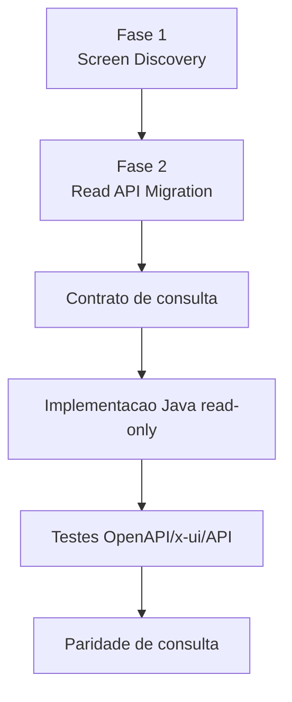

# Exemplos de Prompt para API de Consulta

Estes exemplos sao apenas para a fase de Read API, depois que a tela ja tem
discovery fechado e gate recomendando migracao de leitura. Para iniciar ou
retomar uma tela em fase incerta, use somente
`docs/migracao/backend-api-only-roadmap.md`.

## Pre-condicao Obrigatoria

Antes de usar qualquer prompt deste arquivo:

- `docs/migracao/<CODIGO>/phase-1-execution-gate.md` existe e libera proxima fase;
- `investigation.md`, `component-lineage-matrix.md`, `browser-runtime.md`,
  `operation-inventory.md` e `api-contract.md` existem ou o gate explica a lacuna;
- a fase atual nao esta incerta. Se estiver, volte ao prompt canonico de retomada.

## Fluxo



## Lista / Pesquisa

```text
Pre-condicao: discovery/gate da tela <CODIGO> fechados e recomendando Read API.

Use ergon-archon-read-api-migration para desenhar e implementar o endpoint de lista da tela <CODIGO>.
Consuma browser-runtime.md, component-lineage-matrix.md, investigation.md e api-contract.md.
Confirme SQL legado, binds, filtros, paginacao, ordenacao, escopo de empresa/usuario,
DTO, FilterDTO, testes e matriz de paridade. Nao implemente escrita.
```

## Detalhe por Chave

```text
Pre-condicao: discovery/gate da tela <CODIGO> fechados e recomendando Read API.

Use ergon-archon-read-api-migration para desenhar o endpoint de detalhe da tela <CODIGO>.
Defina chave publica estavel sem expor ROWID, mapeie campos do DTO, fonte SQL,
autorizacao, sessao Oracle e casos de paridade.
```

## Opcoes / Combos

```text
Pre-condicao: discovery/gate da tela <CODIGO> fechados e recomendando Read API.

A skill ergon-archon-read-api-migration so deve ser chamada para combos/lookups da tela <CODIGO> quando esta pre-condicao estiver satisfeita.
Mapeie cada opcao para o SQL legado, filtros dependentes, label/value,
escopo de empresa/usuario, endpoint /options e testes x-ui.
```

## Abas Relacionadas

```text
Pre-condicao: discovery/gate da tela <CODIGO> fechados e recomendando Read API.

Use ergon-archon-read-api-migration para avaliar a aba <ABA> da tela <CODIGO>.
Classifique como Required Now, Candidate, Deferred ou Not API.
Se for Required Now, gere contrato, DTO, filtros, endpoint e casos de paridade.
```

## Endurecimento Read-Only

```text
Pre-condicao: API de consulta da tela <CODIGO> ja implementada ou em revisao na fase correta.

Revise a API de consulta da tela <CODIGO> com ergon-archon-read-api-migration.
Verifique se operacoes de escrita continuam bloqueadas, se schema/openapi estao consistentes,
se filtros preservam o legado e se read-parity-matrix.md cobre os casos principais.
```
