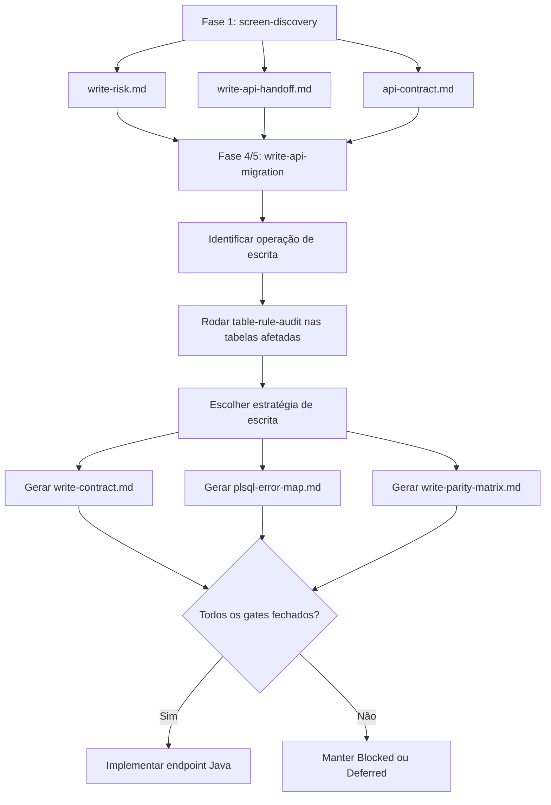
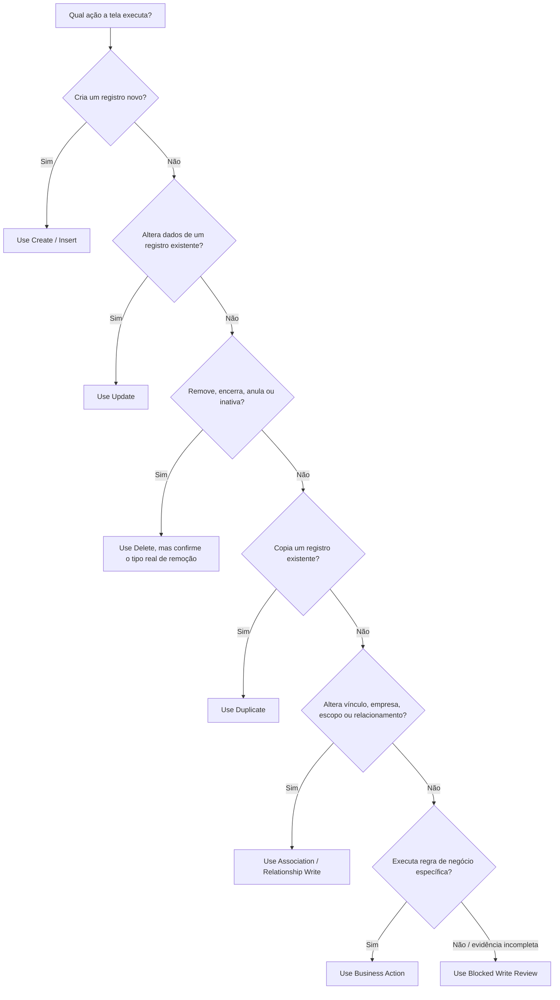
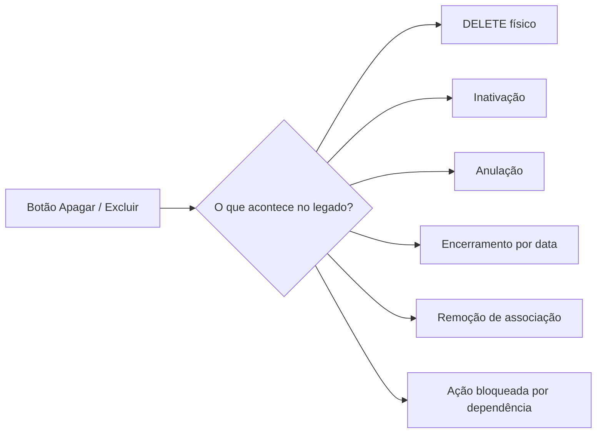
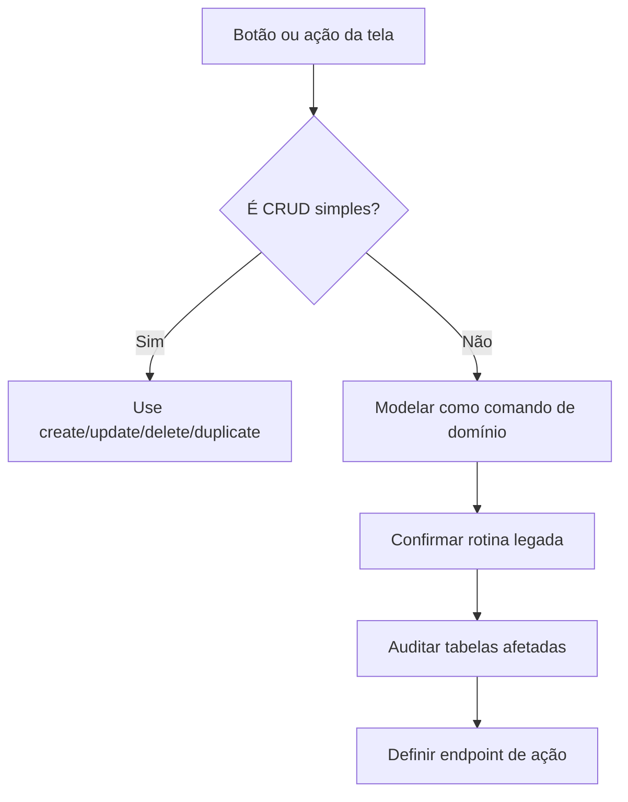

# Exemplos de Prompts por Operação de Escrita

Este guia ajuda a iniciar a trilha de escrita da migração: Fase 4 audita escrita, Fase 5 fecha contrato e Fase 6 implementa operações aprovadas. Referências antigas a "segunda fase" devem ser lidas como históricas.

Na taxonomia atual da orquestração, use este guia depois da descoberta da tela e antes de abrir implementação de escrita.

Use estes prompts depois que a skill `ergon-archon-screen-discovery` já tiver produzido, no mínimo:

- `write-risk.md`;
- `write-api-handoff.md`;
- `api-contract.md`;
- `component-lineage-matrix.md`;
- runtime write payload evidence for the operation: `P_OPER` or equivalent selector, `P_ROWID_REG`/hidden keys, `PB_*`, `PP_*`, `P_MENS`, pending/publication/legal/flex fields, visible messages, and cancel/no-op behavior. Payload inferred only from PL/SQL signatures is not enough for implementation.
- evidências Oracle/XML/runtime suficientes para saber quais ações de escrita existem.

A skill `ergon-archon-write-api-migration` não deve redescobrir a tela do zero. Ela deve consumir os artefatos da fase 1 e fechar uma operação de escrita por vez.

## Visão Geral do Fluxo



## Como Escolher o Prompt Certo



## Campos Para Preencher

Antes de usar qualquer prompt, substitua os marcadores:

| Marcador | O que preencher | Exemplo |
| --- | --- | --- |
| `<SCREEN>` | Código da tela legada | `ERGadm00033` |
| `<RESOURCE>` | Recurso Java/API | `tipos-frequencia` |
| `<OPERATION>` | Nome da operação | `create`, `update`, `aprovar`, `cancelar` |
| `<TABLES>` | Tabelas base e tabelas afetadas | `TIPO_FREQ_`, `TIPO_FREQ_EMPRESA` |
| `<ROUTINES>` | Rotinas legadas candidatas | `ERG_DML_TIPO_FREQ_`, `PCK_TIPO_FREQ` |
| `<PATH>` | Pasta da investigação | `docs/migracao/ERGadm00033` |
| `<public-key>` | Chave pública usada pela API | `tipo|valor` |

## Create / Insert

Use quando a tela cria um novo registro.

Pontos críticos:

- defaults aplicados pelo legado;
- validações antes/depois do insert;
- criação automática de associação;
- auditoria;
- publicação;
- pendência/workflow;
- hooks de cliente em `C_ERGON`.

```text
Use a skill ergon-archon-write-api-migration para fechar a operação de create/insert da tela <SCREEN>.

Contexto:
- Pacote da investigação: <PATH>
- Recurso Java/API: <RESOURCE>
- Operação: criar novo registro
- Tabelas alvo conhecidas: <TABLES>
- Rotinas candidatas: <ROUTINES>

Tarefas:
1. Leia write-api-handoff.md, write-risk.md, api-contract.md e a implementação read-first existente.
2. Confirme no XML/runtime qual ação cria o registro e qual rotina/tabela ela usa.
3. Rode ergon-table-rule-audit para cada tabela alterada ou afetada.
4. Decida se a escrita deve usar legacy-routine, direct-table-with-triggers, java-reimplementation, blocked ou not-api.
5. Produza ou atualize write-contract.md, plsql-error-map.md e write-parity-matrix.md.
   - Antes de implementar, confirme payload runtime real, convenção do módulo/starter, auditoria EP/HADES, tabelas de efeito colateral, uso da ponte legado compartilhada quando houver `FLAG_PACK`/`ERG_DML_*`, smoke API, contagens Oracle, cleanup final e classificação de resultado legado (`APPLIED`, `PENDING_CREATED`, `BLOCKED_BY_LEGACY_ERROR`, `UNKNOWN`).
6. Só implemente Java se todos os gates estiverem fechados.

O parecer deve dizer quais validações, defaults, associações, auditoria, pendências, publicação e hooks C_ERGON precisam ser preservados.
```

## Update

Use quando a tela altera um registro existente.

Pontos críticos:

- como localizar a linha sem expor `ROWID`;
- se a chave pode mudar;
- quais campos são editáveis;
- validações de alteração;
- efeitos colaterais em tabelas relacionadas;
- comportamento de read-after-write.

```text
Use a skill ergon-archon-write-api-migration para fechar a operação de update da tela <SCREEN>.

Contexto:
- Pacote da investigação: <PATH>
- Recurso Java/API: <RESOURCE>
- Operação: atualizar registro existente
- Chave pública/API atual: <public-key>
- Tabelas alvo conhecidas: <TABLES>
- Rotinas candidatas: <ROUTINES>

Tarefas:
1. Confirme como a linha legada é localizada sem expor ROWID publicamente.
2. Verifique se a chave pode ser alterada ou deve ser imutável.
3. Rode ergon-table-rule-audit para as tabelas alteradas e side-effect tables.
4. Mapeie validações legadas, mensagens PL/SQL e efeitos colaterais.
5. Defina command DTO separado quando o DTO de leitura tiver campos derivados, ocultos ou somente visualização.
6. Atualize write-contract.md, plsql-error-map.md e write-parity-matrix.md.

Não remova o comportamento read-only/405 até provar que update preserva regras de produto, regras de cliente, session context e read-after-write.
```

## Delete

Use quando a tela remove ou deixa de exibir um registro.

Antes de implementar, confirme o que o legado realmente faz:



```text
Use a skill ergon-archon-write-api-migration para fechar a operação de delete da tela <SCREEN>.

Contexto:
- Pacote da investigação: <PATH>
- Recurso Java/API: <RESOURCE>
- Operação: excluir registro
- Tabelas alvo conhecidas: <TABLES>
- Rotinas candidatas: <ROUTINES>

Tarefas:
1. Confirme no legado se a ação é delete físico, anulação, encerramento, inativação ou remoção de associação.
2. Verifique confirmação de UI, permissões, dependências, cascatas, triggers, pending workflow e auditoria.
3. Rode ergon-table-rule-audit para a tabela principal e tabelas de dependência/associação afetadas.
4. Mapeie erros de dependente existente e diferencie bloqueio por permissão de bloqueio por integridade.
5. Atualize write-contract.md, plsql-error-map.md e write-parity-matrix.md.

Se delete físico não estiver comprovado, mantenha a operação Blocked ou modele como ação de negócio específica.
```

## Duplicate

Use quando a tela copia um registro existente para criar outro.

Não assuma que duplicar é igual a copiar todos os campos. O legado pode:

- limpar campos;
- gerar nova chave;
- aplicar defaults;
- copiar apenas parte dos dados;
- recriar associações;
- chamar as mesmas validações do create.

```text
Use a skill ergon-archon-write-api-migration para fechar a operação de duplicate da tela <SCREEN>.

Contexto:
- Pacote da investigação: <PATH>
- Recurso Java/API: <RESOURCE>
- Operação: duplicar registro
- Registro fonte: resolvido por <public-key>
- Tabelas alvo conhecidas: <TABLES>

Tarefas:
1. Observe no legado quais campos são copiados, quais são limpos, quais recebem defaults e quais devem ser informados pelo usuário.
2. Verifique se a duplicação chama a mesma rotina de create ou uma rotina própria.
3. Rode ergon-table-rule-audit para tabelas alteradas.
4. Defina se a API será POST /<resource>/{id}/duplicate ou create com sourceId.
5. Crie casos de paridade para duplicação válida, chave duplicada, sem permissão e read-after-write.

Não assumir que duplicate é apenas create com payload copiado; confirmar defaults e side effects.
```

## Association / Relationship Write

Use quando a operação muda vínculo, empresa, escopo, permissão, membro de grupo ou relação entre entidades.

Exemplos:

- associar tipo de frequência a empresa;
- remover vínculo de uma tabela de escopo;
- incluir item em grupo;
- alterar visibilidade por empresa;
- criar/remover linha em tabela `*_EMPRESA`.

```text
Use a skill ergon-archon-write-api-migration para fechar a escrita de associação da tela <SCREEN>.

Contexto:
- Pacote da investigação: <PATH>
- Recurso Java/API: <RESOURCE>
- Operação: criar/remover/alterar associação
- Tabelas de associação: <TABLES>
- Rotinas candidatas: <ROUTINES>

Tarefas:
1. Confirme se a associação é controlada pela tela, por trigger/package da tabela principal ou por rotina separada.
2. Verifique escopo de empresa/usuário, especialmente FLAG_PACK.GET_EMPRESA e valores especiais do seletor.
3. Rode ergon-table-rule-audit na tabela principal e na tabela de associação.
4. Defina se a API deve expor sub-recurso, ação de negócio ou ser mantida como side effect do create/delete principal.
5. Atualize write-contract.md e write-parity-matrix.md com casos de empresa atual, empresa geral, sem associação e sem permissão.
```

## Business Action

Use para ações que não são CRUD simples.

Exemplos:

- aprovar;
- cancelar;
- encerrar período;
- publicar;
- gerar documento;
- recalcular;
- efetivar pendência;
- estornar;
- anular.



```text
Use a skill ergon-archon-write-api-migration para fechar a ação de negócio <OPERATION> da tela <SCREEN>.

Contexto:
- Pacote da investigação: <PATH>
- Recurso Java/API: <RESOURCE>
- Ação de negócio: <OPERATION>
- Rotinas candidatas: <ROUTINES>
- Tabelas afetadas conhecidas: <TABLES>

Tarefas:
1. Confirme no XML/runtime qual botão/link dispara a ação e quais parâmetros são enviados.
2. Classifique a ação: workflow, publicação, documento legal, recálculo, pendência, anulação, estorno ou outro.
3. Identifique todas as tabelas afetadas direta e indiretamente.
4. Rode ergon-table-rule-audit para tabelas alteradas relevantes.
5. Modele endpoint de comando, não CRUD genérico, com nome de domínio claro.
6. Defina contrato, erros, autorização, session context, transação e matriz de paridade.

Não implementar como update parcial se o legado executa rotina de negócio com side effects próprios.
```

## Blocked Write Review

Use quando ainda não há evidência suficiente para codar.

O objetivo não é implementar. O objetivo é descobrir exatamente o que falta.

```text
Use a skill ergon-archon-write-api-migration para revisar por que a escrita da tela <SCREEN> continua bloqueada.

Contexto:
- Pacote da investigação: <PATH>
- Operações candidatas: <operations>
- Tabelas/rotinas já identificadas: <TABLES> / <ROUTINES>

Tarefas:
1. Leia write-risk.md, write-api-handoff.md, write-contract.md, plsql-error-map.md e write-parity-matrix.md se existirem.
2. Liste os gates ainda abertos por operação.
3. Indique a próxima evidência concreta para destravar cada gate: XML, browser runtime, SQL Oracle, table-rule audit, Java session context, permissão ou teste de paridade.
4. Não implemente código; produza somente decisão `Blocked`, `Deferred`, `Ready for audit`, `Ready for write design`, ou `Ready for implementation` com evidências.
```

## Resultado Esperado de Cada Prompt

Ao final de qualquer operação, a resposta deve deixar claro:

| Pergunta | Resposta esperada |
| --- | --- |
| A operação é implementável agora? | `Ready for audit`, `Ready for write design`, `Ready for implementation`, `Implemented`, `Blocked`, `Deferred` ou `Not API` |
| Qual estratégia será usada? | `legacy-routine`, `direct-table-with-triggers`, `java-reimplementation`, `blocked` ou `not-api` |
| Quais tabelas foram auditadas? | Lista de tabelas e evidências |
| Quais regras ativas existem? | Produto, cliente, auditoria, pendência, publicação, constraints |
| O que Java precisa preservar? | Validação, side effect, hook, autorização, erro ou nada |
| Quais testes de paridade são necessários? | Sucesso, validação, permissão, dependência, rollback, read-after-write |

## Regra de Ouro

Não habilite escrita no Java apenas porque já existe endpoint read-first.

Uma operação de escrita só deve sair de `Blocked` ou `Deferred` quando o caminho escolhido preservar explicitamente:

- regras de produto;
- customizações do cliente;
- session context Oracle;
- auditoria;
- pendências/workflow;
- publicação/documentos;
- permissões;
- mensagens de erro;
- comportamento de rollback;
- read-after-write.
