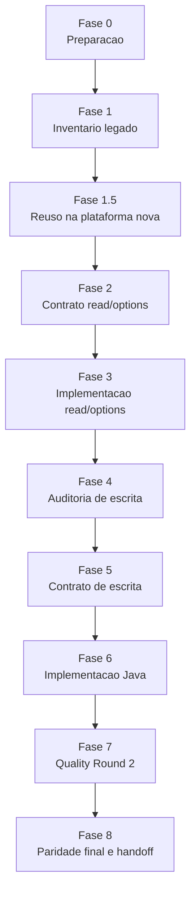

# Roteiro PT-BR de Migracao Ergon/Archon

## Visao Geral

Subfase intermediaria:

- Fase 1.5: discovery de reuso na plataforma nova antes de desenhar endpoints novos.

## Arquivos De Gerenciamento

Todo pacote de tela fica em `docs/migracao/<CODIGO>/`.

Obrigatorios por tela:

- `migration-plan.md`: criado na Fase 0 e atualizado quando escopo ou ordem mudar.
- `operation-inventory.md`: criado ate a Fase 1 e mantido atualizado.

Obrigatorio ao fechar qualquer fase:

- `phase-<PHASE-ID>-execution-gate.md`: decisao, evidencia executada, residuos, regra de retorno e proximo prompt.
- quando o gate estiver `Ready for next phase` ou `Ready for next phase with adjustments`, ele tambem deve permitir continuacao curta com `continuar`, `seguir`, `ok`, `1`, `proximo` ou `próximo`.

Condicional:

- `phase-<PHASE-ID>-<slug>-plan.md`: planejamento/reentrada. Nao e evidencia nem fechamento.

Para fases decimais, use hifen no nome: `phase-1-5-execution-gate.md`.

## Endpoint Execution Parity

Quando endpoints estiverem implementados, nao aceite apenas teste estatico, OpenAPI, schema ou teste mockado como paridade. Para marcar `Verified`, o agente deve executar endpoints reais, capturar payload/resposta e comparar:

- contrato API/FieldSpec: `/schemas/filtered`, options, selected reload, HATEOAS/actions e metadados publicados;
- tela legada autenticada: mesmo usuario, empresa, contexto, filtros e selecao de linha;
- dados esperados: totais, ids/chaves, campos, labels, ordenacao, paginacao, mensagens e empty state.

Estados intermediarios validos: `Schema/static contract passed`, `Executed endpoint smoke`, `Legacy parity pending`, `Blocked` ou `Deferred`. Nao use `Verified` sem execucao e comparacao.

## Fases

### Fase 0 - Preparacao

Skill: `ergon-migration-orchestration`

Saidas: `migration-plan.md` e `phase-0-execution-gate.md`. Deve preparar pacote canonico, repos backend, acesso ao legado, rota `.tp`, XML exportado/local e conexao Oracle read-only, ou registrar blockers objetivos.

Se credenciais do legado estiverem disponiveis na sessao ativa, a Fase 0 deve tentar login no app legado antes de decidir o status de `.tp` e `.xml`. `401`/`403` fora de sessao indicam rota protegida, mas nao bastam para fechar `Ready for next phase with adjustments` se o login ainda nao foi tentado. Depois do login, reabrir `.tp` e tentar exportar `.xml` com a sessao autenticada, sem registrar usuario, senha, cookie ou token.

### Fase 1 - Inventario legado da tela

Skill: `ergon-archon-screen-discovery`

Saidas: `browser-runtime.md`, `runtime-capture-form.md` quando workflow browser for parcial, `cronos-source-of-truth.md`, `component-lineage-matrix.md`, `investigation.md`, `operation-inventory.md`, `legacy-doc-sources.md`, `read-parity-matrix.md`, `closure-checklist.md`, SQL/outputs Oracle-HADES quando aplicavel, e `phase-1-execution-gate.md`.

A Fase 1 nao pode fechar como pronta quando:

- ha XML runtime/local/HADES relevante e falta `cronos-source-of-truth.md`;
- o browser nao foi operado e falta `runtime-capture-form.md`;
- o gate cita HADES pendente sem SQL/helper de retomada;
- `operation-inventory.md` usa `Unknown` como estado de operacao;
- os artefatos Markdown registram labels PT-BR com encoding quebrado.

### Fase 1.5 - Reuso na plataforma nova

Skill: `ergon-archon-screen-discovery` com inspecao Java/OMS novo

Saidas: `platform-reuse-inventory.md`, decisoes `reuse/extend/create/block/defer/not-api` e `phase-1-5-execution-gate.md`.

### Fase 2 - Contrato read/options

Skills: `ergon-archon-read-api-migration` + `ergon-fieldspec-ui-contract`

Saidas: `api-contract.md`, `ui-contract-checklist.md`, `read-parity-matrix.md`, plano de testes e `phase-2-execution-gate.md`.

### Fase 3 - Implementacao read/options

Skill: `ergon-archon-read-api-migration`

Saidas: codigo/testes, OpenAPI/schema/x-ui, execucao real de endpoints com payload/resposta, `read-parity-results.md` e `phase-3-execution-gate.md`.

### Fase 4 - Auditoria de escrita

Skills: `ergon-table-rule-audit` + `ergon-archon-write-api-migration`

Saidas: `write-risk.md`, `write-api-handoff.md`, auditorias em `oracle-results/table-rule-audit/` e `phase-4-execution-gate.md`.

### Fase 5 - Contrato de escrita

Skills: `ergon-archon-write-api-migration` + `ergon-fieldspec-ui-contract`

Saidas: `write-contract.md`, `write-route-decision.md`, `plsql-error-map.md`, `write-parity-matrix.md`, `ui-contract-checklist.md` atualizado e `phase-5-execution-gate.md`.

### Fase 6 - Implementacao Java

Skill: `ergon-archon-write-api-migration` quando envolver operacao de escrita

Saidas: codigo/testes/API smoke/paridade por operacao, bloqueios explicitos para o restante e `phase-6-execution-gate.md`.

### Fase 7 - Quality Round 2

Skill: `ergon-migration-orchestration`

Saidas: `quality-round-2.md`, evidencias browser/API, payloads/respostas, metadata FieldSpec/HATEOAS/actions, matriz legado x endpoint, e `phase-7-execution-gate.md`.

### Fase 8 - Paridade final e handoff

Skill: `ergon-migration-orchestration`

Saidas: `parity-results.md`, `backend-api-handoff.md` ou `pilot-handoff.md` escopado, riscos residuais, decisao de entrega e `phase-8-execution-gate.md`.

## Prompts Canonicos

Para iniciar tela nova ou diagnosticar tela existente, use somente:

- `docs/migracao/backend-api-only-roadmap.md`, secao `Prompt Inicial Para Tela Nova`;
- `docs/migracao/backend-api-only-roadmap.md`, secao `Prompt De Retomada Ou Diagnostico`.

Este roadmap nao duplica prompts operacionais para evitar divergencia.

Depois de um gate `Ready`, o desenvolvedor nao precisa repetir prompt longo. Pode enviar `continuar`, `seguir`, `ok`, `1`, `proximo` ou `próximo`; o orquestrador deve usar o ultimo gate como fonte da proxima fase, skill, entradas, saidas e residuos.
